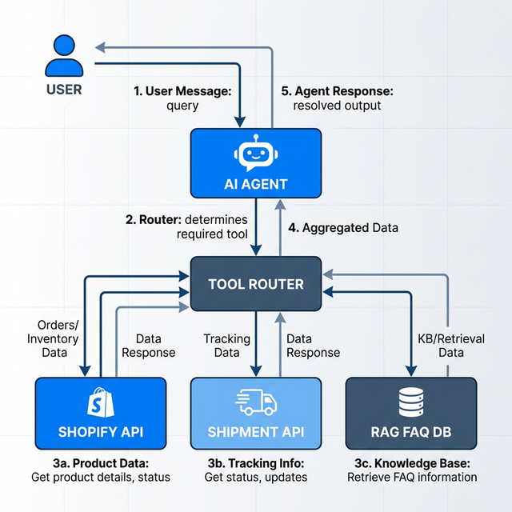

# AI Shopify Support Agent 🤖🛍️

An autonomous AI customer support agent designed specifically for Shopify stores. This agent handles customer inquiries seamlessly by interacting with mock Shopify APIs for real-time order data and utilizing a RAG (Retrieval-Augmented Generation) pipeline to query an internal knowledge base for policies and FAQs.

## ✨ Features

- **Agentic Workflow**: Utilizes OpenAI Tool Calling to autonomously decide when to fetch order data versus when to search the knowledge base.
- **RAG Knowledge Retrieval**: Embeds and indexes company policies (like Shipping and Refunds) into a local vector database for semantic search.
- **Shopify API Integration**: Simulates fetching live order details and fulfillment statuses using strict Pydantic schemas.
- **Order Tracking & Refunds**: Specialized tools allow the agent to track shipments and initiate refund workflows.
- **Conversational Memory**: Maintains session context across multi-turn conversations using Redis, allowing the agent to remember previously mentioned order numbers.

## 🏗️ Architecture

The system follows a modular, robust architecture combining LangChain's orchestration with a modern FastAPI backend:



1. **User Message**: The user sends a query to the `POST /chat` endpoint.
2. **AI Agent**: The LangChain Executor (powered by `gpt-4o-mini`) processes the input and conversational history.
3. **Tool Router**: Based on the context, the agent intelligently routes the request to the appropriate tool:
    - **Shopify API Tool**: Retrieves JSON order data.
    - **Shipment API Tool**: Fetches mock courier tracking updates.
    - **RAG FAQ DB Tool**: Searches the pgvector database for policy documentation.
4. **Agent Response**: The agent synthesizes the tool outputs into a natural, conversational response.

## 🛠️ Tech Stack

- **Backend Framework**: Python 3.11, [FastAPI](https://fastapi.tiangolo.com/)
- **AI & Orchestration**: [LangChain](https://www.langchain.com/), OpenAI (`gpt-4o-mini`, `text-embedding-3-small`)
- **Vector Database**: PostgreSQL with [pgvector](https://github.com/pgvector/pgvector)
- **Memory Store**: [Redis](https://redis.io/)
- **Containerization**: Docker & Docker Compose

## 🚀 Quick Start (Run Locally)

### 1. Prerequisites
- Docker and Docker Compose installed.
- An OpenAI API Key.

### 2. Setup
Clone the repository and set up your environment variables:
```bash
git clone https://github.com/sirklc/AI-Shopify-Support-Agent.git
cd AI-Shopify-Support-Agent
cp .env.example .env
```
👉 **Open the `.env` file and insert your actual `OPENAI_API_KEY`.**

### 3. Run the Application
Spin up the entire stack (FastAPI web server, PostgreSQL vector database, and Redis cache) with a single command:
```bash
docker compose up --build -d
```
*Note: On startup, the application will automatically embed the markdown files inside the `/faq` folder and index them into pgvector.*

## 🧪 Testing the API

Once the system is running, you can test the AI agent using cURL.

**Test 1: Order Tracking (Tool Calling)**
```bash
curl -X POST http://localhost:8000/chat \
     -H "Content-Type: application/json" \
     -d '{"session_id": "demo_user_1", "message": "Hi, where is my order #555?"}'
```

**Test 2: Conversational Memory (Context Retention)**
```bash
# Notice we don't mention the order number again
curl -X POST http://localhost:8000/chat \
     -H "Content-Type: application/json" \
     -d '{"session_id": "demo_user_1", "message": "Can I get a refund for it?"}'
```

**Test 3: Knowledge Base (RAG)**
```bash
curl -X POST http://localhost:8000/chat \
     -H "Content-Type: application/json" \
     -d '{"session_id": "demo_user_2", "message": "How long does international shipping take?"}'
```

## 📂 Repository Layout

```text
ai-shopify-support-agent
│
├ README.md                 # Project documentation
├ architecture.png          # System architecture diagram
├ docker-compose.yml        # Multi-container orchestration
├ requirements.txt          # Python dependencies
│
├ app/                      # Core Application Source
│   ├ main.py               # FastAPI entry point & lifespan events
│   ├ config.py             # Pydantic environment configuration
│   ├ api/                  # REST API routes
│   ├ agents/               # LangChain OpenAI Tool Calling Agent
│   ├ memory/               # Redis conversational history management
│   ├ rag/                  # Embeddings, Vector Indexer, and Retriever
│   └ tools/                # Mock APIs (Shopify, Shipments, Refunds, FAQ)
│
├ faq/                      # Markdown knowledge base files
├ tests/                    # Pytest test suite
└ docker/                   # Dockerfiles
```
